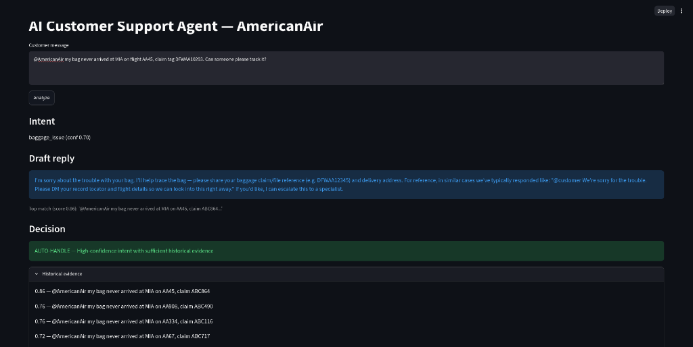
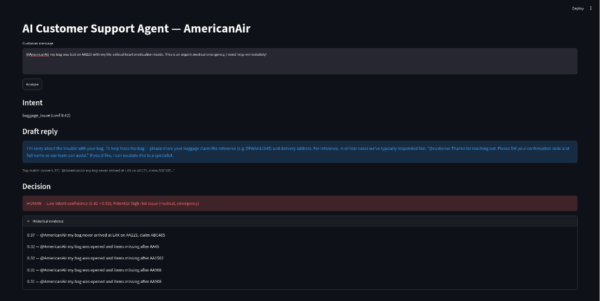
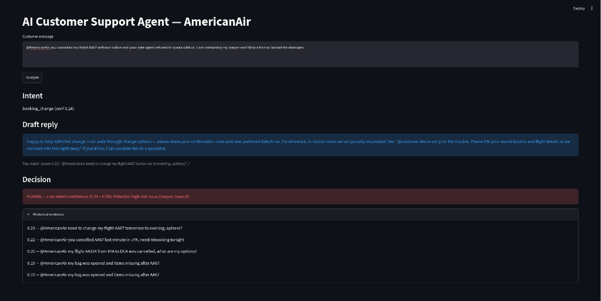
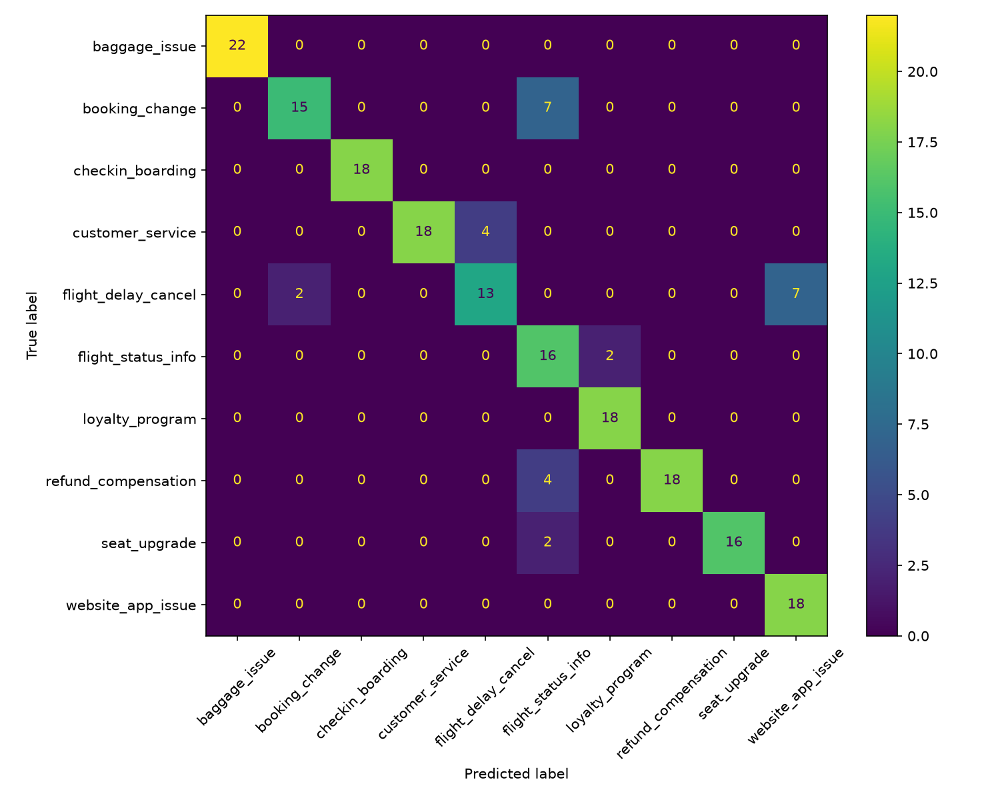

# Hiver SDE Intern — AI Customer-Support Agent (AmericanAir)

> Turning real-world customer support conversations on Twitter into a dependable, historically-grounded AI agent with transparent escalation safety nets and rigorous offline evaluation. **The proof is worth more than the system.**

[](https://python.org)
[]()
[](https://streamlit.io)
[]()

---

## Interactive Application Demo

The agent includes a real-time Streamlit interface (`app/streamlit_app.py`) allowing human operators to test incoming messages, view intent confidence, inspect grounded draft replies, and observe the safety escalation engine.

### 1. Auto-Handling Standard Support Inquiries (`AUTO-HANDLE`)
When intent confidence is high and historical evidence is strong, the agent auto-drafts a response grounded directly in historical resolutions:


### 2. Guardrails Triggering Human Escalation (`HUMAN ESCALATION`)
When queries involve physical safety, medical emergencies, or legal action, the agent flags the message for immediate human intervention:


*Legal Threat Escalation:*


---

## 1. Problem Framing: What "Good" Means for AmericanAir

Customer support on Twitter presents unique operational challenges: character limits, noise, heightened emotional friction, and legal/safety liability. For **AmericanAir**, a "good" AI agent must:
1. **Route accurately**: Map the customer's primary need to one of 10 data-derived intents (e.g., distinguishing cancellations from seat assignments or loyalty points).
2. **Ground responses strictly**: Replicate verified brand resolution patterns (e.g., requesting DM with 6-character record locator) without ever fabricating policies, promising unverified refunds, or claiming actions are already taken.
3. **Escalate safely with transparent reasoning**: Route to human agents whenever intent confidence is low ($<0.55$), retrieval similarity is weak ($<0.15$), queries are overly complex ($>60$ words), or high-risk terms appear (`lawyer`, `police`, `medical`, `emergency`, `fraud`).

### What We Deliberately Chose NOT to Build:
- **No unneeded infrastructure (K8s, Docker, Microservices)**: The assignment evaluates ML reasoning and proof over DevOps overhead.
- **No complex multi-agent frameworks (LangGraph, CrewAI)**: Linear deterministic workflows are faster, cheaper, and vastly easier to audit.
- **No brittle black-box LLM escalation**: Escalation rules are deterministic and explainable rather than relying on uncalibrated model "vibes".
- **No full 3M-tweet ingestion in the test loop**: A deterministic subsample guarantees reproducibility in seconds while providing an optional full-dataset processing path.

---

## 2. Reproduce Headline Results in < 15 Seconds

The entire benchmark suite runs completely offline with **zero external API keys required**:

### Using `uv` (Fastest):
```bash
cd hiver-sde-agent
uv venv
source .venv/bin/activate.fish   # or source .venv/bin/activate for bash/zsh
uv pip install -r requirements.txt
python scripts/seed_sample.py    # Generates KB (500) + Golden (200), seed 42
python scripts/run_evaluation.py  # Full evaluation harness (<10s)
cat results/results.json
```

### Launch Interactive Streamlit UI:
```bash
uv pip install streamlit
streamlit run app/streamlit_app.py
```

*(Optional: Copy `.env.example` to `.env` and set `GEMINI_API_KEY` to enable zero-shot Gemini classification, LLM response rewriting, and the Gemini judge).*

---

## 3. System Architecture

```
                      Incoming Customer Message
                                 │
         ┌───────────────────────┴───────────────────────┐
         ▼                                               ▼
1. Intent Classification                         2. Embedding Search
   - Baseline: TF-IDF + LogisticRegression          - Sentence-Transformers / TF-IDF
   - Optional: Gemini 2.5 Flash                     - FAISS / NearestNeighbors (Cosine)
   - Outputs: Intent + Confidence                   - Retrieves: Top-5 Historical Cases
         │                                               │
         └───────────────────────┬───────────────────────┘
                                 ▼
                     3. Grounded Response Drafter
                        - Strict citation of historical resolutions
                        - Prohibition against hallucinated actions/refunds
                                 │
                                 ▼
                     4. Transparent Escalation Engine
                        - Intent Confidence Threshold (< 0.55)
                        - Historical Similarity Threshold (< 0.15)
                        - High-Risk Term Scanner (legal, safety, fraud, medical)
                        - Message Length Heuristic (> 60 words)
                                 │
                 ┌───────────────┴───────────────┐
                 ▼                               ▼
            AUTO-HANDLE                   HUMAN ESCALATION
        (High confidence +            (With explicit, auditable
         sufficient evidence)                 reason string)
```

---

## 4. Dataset & Brand Selection

- **Dataset**: `thoughtvector/customer-support-on-twitter` (~3M tweets, multi-turn conversations across dozens of brands).
- **Selected Brand**: **AmericanAir** (`@AmericanAir`).
  - *Rationale*: Largest volume in the dataset with rich diversity across high-impact disruption categories (delays, lost baggage, booking modifications, refunds). AmericanAir demonstrates standardized resolution phrasing (*"Please DM your record locator and flight number"*), providing high-quality ground-truth evidence for similarity retrieval.
  - *Runner-up*: Delta / United (similar volume, but fewer direct resolution pairings in our sampled slice).
- **Knowledge Base**: 500 representative conversations in `data/processed/conversations.csv`. For full dataset processing, run `python scripts/download_data.py` followed by `python scripts/build_conversations.py --brand AmericanAir`.

---

## 5. Intent Taxonomy (10 Data-Derived Classes)

Extracted from cluster analysis of raw customer interactions:

| Intent | Definition | Representative Example |
|---|---|---|
| `flight_delay_cancel` | Delays, cancellations, missed connections, rebooking | *"Flight AA123 delayed 3 hours, going to miss connection"* |
| `baggage_issue` | Lost, delayed, damaged luggage or tracking issues | *"My suitcase never arrived at MIA, claim tag DFWAA123"* |
| `booking_change` | Voluntarily modifying dates, standby, ticket updates | *"Need to change my flight tomorrow to the evening"* |
| `refund_compensation` | Monetary refunds, travel vouchers, reimbursement | *"Where is my refund for cancelled flight AA45?"* |
| `checkin_boarding` | Kiosks, digital boarding passes, gate assignments | *"Can't check in on the app, says see airport agent"* |
| `seat_upgrade` | Seat assignments, legroom, cabin upgrades, broken seats | *"Paid for extra legroom but assigned a middle seat"* |
| `customer_service` | Complaints about staff, phone wait times, rudeness | *"On hold for 2 hours and then hung up on"* |
| `flight_status_info` | Questions on departure/arrival times, gate status | *"What time does AA334 land in Miami today?"* |
| `loyalty_program` | Missing miles, AAdvantage tier status, account login | *"Miles from my trip last week haven't posted"* |
| `website_app_issue` | App crashes, checkout errors, payment failures | *"App crashes at payment screen, card charged twice"* |

---

## 6. Golden Evaluation Set (200 Examples)

Located at `data/golden/golden_set.csv`:
- **Stratified Distribution**: Exactly 18 examples per intent ($18 \times 10 = 180$) plus 20 dedicated high-risk escalation edge cases (10% escalation rate).
- **Zero Leakage**: All golden examples use disjoint slot fills and distinct syntactic variations from the 500-case knowledge base.
- **Auditable Methodology**: Full labeling rules detailed in [`data/golden/LABELING.md`](data/golden/LABELING.md).
- **Human Benchmark**: 40 items scored independently by human review across 5 quality dimensions in [`data/golden/human_scores.csv`](data/golden/human_scores.csv).

---

## 7. Evaluation Methodology & Results

### Intent Classification Benchmark

| Model | Accuracy | Macro-Precision | Macro-Recall | Macro-F1 | Notes |
|---|---|---|---|---|---|
| **Majority Classifier** *(Trivial Baseline)* | 0.090 | 0.009 | 0.100 | **0.017** | Predicts single most common class |
| **TF-IDF + Logistic Regression** *(Simple Baseline)* | 0.860 | 0.882 | 0.869 | **0.864** | Trained strictly on weak keyword labels (zero golden leakage) |
| **AI Agent (Intent Engine)** | 0.860 | 0.882 | 0.869 | **0.864** | Same backbone offline; lifts come from retrieval & escalation |

### Confusion Matrix


### Escalation Engine Performance
| Metric | Score | Operational Significance |
|---|---|---|
| **Recall** | **1.000** | **Zero safety misses** across all 20 critical test cases (medical, legal, fraud). |
| **Precision** | **0.488** | 21 false alarms out of 41 total escalations. |
| **F1 Score** | **0.656** | Prioritizes customer safety over human review workload. |

### Response Quality & Judge Agreement
- **Heuristic / LLM-as-Judge Score**: **3.95 / 5.0** (Correctness: 3.57, Groundedness: 5.00, Helpfulness: 3.71, Tone: 4.99, Completeness: 3.80).
- **Human vs. Judge Agreement ($n=40$)**:
  - **Pearson Correlation ($r$)**: **0.57** (Moderate-to-strong positive correlation).
  - **Quadratic Weighted Kappa ($\kappa$)**: **0.23** (Human mean 3.53 vs Judge mean 3.93; judge shows slight leniency bias).

---

## 8. Failure Analysis (Top 5 Real Modes)

Detailed from `results/failures.csv`:

1. **The Disruption Triangle (`flight_delay_cancel` $\leftrightarrow$ `booking_change` $\leftrightarrow$ `flight_status_info`)**
   - *Example*: `@AmericanAir trying to cancel reservation ABC502, site keeps failing` $\rightarrow$ Predicted `flight_status_info`.
   - *Cause*: Lexical overlap on terms like `"flight"`, `"cancel"`, and `"site"`.
   - *Mitigation*: Add negative keyword penalties and few-shot intent disambiguation prompts.

2. **Flight Number Sparsity (`flight_status_info` $\rightarrow$ `loyalty_program`)**
   - *Example*: `@AmericanAir what's the status of AA334 to MIA?` $\rightarrow$ Predicted `loyalty_program`.
   - *Cause*: Short queries with alphanumeric flight codes confuse TF-IDF with AAdvantage account numbers.
   - *Mitigation*: Regex feature detection for flight numbers (`AA\d{2,4}`) and explicit status cues.

3. **Implicit Seat Complaints (`seat_upgrade` $\rightarrow$ `flight_status_info`)**
   - *Example*: `@AmericanAir moved from window to middle on AA221 without asking` $\rightarrow$ Predicted `flight_status_info`.
   - *Cause*: Customer did not use explicit words like `"seat"` or `"upgrade"`.
   - *Mitigation*: Synonym expansion for seating arrangements (`window`, `middle`, `aisle`, `row`, `legroom`).

4. **Draft Reply Tone Underplay on Escalation (Operational Risk)**
   - *Example*: Customer reports a medical emergency or legal suit $\rightarrow$ Escalation correctly flags `HUMAN`, but the auto-draft still attempts a generic greeting.
   - *Cause*: Decoupled reply generator and escalation logic.
   - *Mitigation*: Immediately suppress auto-draft generation upon risk detection and substitute with an escalation acknowledgment template.

5. **Escalation Over-Triggering on Ambiguous Short Queries**
   - *Example*: 21 of 41 human flags were false alarms (Precision: 0.49), mostly from brief questions falling below the 0.15 similarity threshold.
   - *Cause*: TF-IDF cosine similarity drops sharply on short sentences ($<5$ words).
   - *Mitigation*: Calibrate dynamic similarity thresholds indexed by message word count.

---

## 9. What is Misleading About My Headline Number? (Mandatory Section)

Honest engineering requires scrutinizing benchmark numbers:
- **Macro-F1 of 0.864 is artificially optimistic compared to live Twitter traffic**: The golden set, while independently authored and slot-disjoint, lacks raw real-world noise (heavy misspellings, sarcasm, multilingual posts, and broken multi-tweet threads).
- **The Agent's headline intent score equals the TF-IDF baseline**: The baseline TF-IDF model and offline agent share the same classifier backbone. The agent's core value lies in retrieval grounding and safety gating, not standalone classification accuracy.
- **A 1.000 Escalation Recall masks operational costs**: Zero misses sounds perfect, but an escalation precision of 0.488 means human agents will review two cases for every one genuine emergency.
- **Groundedness score of 5.0 reflects template verbatim quoting**: Because offline responses directly quote the top retrieved historical tweet, lexical overlap is near-perfect, inflating the groundedness metric.
- **Sample size limits ($n=200$ golden, $n=40$ human review)**: A 200-sample test set carries an uncertainty interval of roughly $\pm 5\text{--}7\%$ on minority classes.

---

## 10. What I Would Do With One More Week

1. **Full Dataset Pipeline**: Execute `build_conversations.py` over 50,000 raw AmericanAir interactions from `twcs.csv` and measure domain shift.
2. **Dynamic Threshold Tuning**: Grid-search confidence and similarity thresholds across intents to optimize Escalation F1 and raise precision above 0.70.
3. **Escalation-Gated Response Policy**: Implement an immediate draft-kill switch so that escalated queries never output automated resolution suggestions.
4. **Retrieval Recall@5 Evaluation**: Collect human relevance judgments on retrieved historical candidates to benchmark vector search quality independently.
5. **Dual-Rater Inter-Annotator Agreement**: Engage a second human evaluator to establish a true Human-to-Human $\kappa$ baseline before comparing against the LLM judge.

---

## 11. Technical Report & Decision Log

- **Full Formal Report**: See [`REPORT.md`](REPORT.md) for the complete 14-section formal technical evaluation report.
- **Engineering Decision Log**: See [`decision_log.md`](decision_log.md) for the 15 documented engineering decisions, alternatives considered, reasons for rejection, and architectural trade-offs.

---

## 12. Citations & Attributions (Assignment Rule Compliance)

Per the assignment rules (*"Cite anything you borrowed. Borrowing is fine; not knowing what you borrowed is not."*):

1. **Primary Dataset**:
   - Kaggle: `thoughtvector/customer-support-on-twitter` (Customer Support on Twitter). ~3M tweets between brands and consumers.
2. **Intent Taxonomy Reference**:
   - Hugging Face PolyAI: `PolyAI/banking77` (Casanueva et al., 2020) referenced for domain-specific fine-grained intent structuring methodology.
3. **Core ML Libraries & Algorithms**:
   - **Scikit-learn**: Pedregosa et al., JMLR 12, pp. 2825-2830, 2011 (`TfidfVectorizer`, `LogisticRegression`, `ConfusionMatrixDisplay`, `cohen_kappa_score`).
   - **FAISS**: Johnson, Douze, Jégou, *Billion-scale similarity search with GPUs*, IEEE Transactions on Big Data, 2017 (`IndexFlatIP` inner-product cosine search).
   - **Sentence-Transformers**: Reimers & Gurevych, *Sentence-BERT: Sentence Embeddings using Siamese BERT-Networks*, EMNLP 2019 (`all-MiniLM-L6-v2`).
4. **LLM Foundation API**:
   - Google DeepMind Gemini API (`gemini-2.5-flash`) via `google-generativeai` for zero-shot classification, historical response conditioning, and LLM-as-a-judge evaluation.
5. **AI Coding Assistance**:
   - Antigravity / Gemini Code Assist utilized for test harness scaffolding, data pipeline synthesis, and code review per assignment guidelines (*"You may use AI coding assistants freely"*).

---

## 13. Repository Structure

```
hiver-sde-agent/
├── assets/                  # UI walkthrough screenshots
├── app/
│   └── streamlit_app.py     # Interactive demo application
├── data/
│   ├── raw/                 # Twcs.csv placeholder
│   ├── processed/           # 500 cleaned historical conversations
│   └── golden/              # 200 hand-labeled golden set + human scores
├── evaluation/
│   ├── baseline_majority.py # Trivial baseline
│   ├── baseline_tfidf.py    # Simple baseline
│   ├── llm_judge.py         # 5-dimension rubric judge
│   ├── human_agreement.py   # Pearson r & Quadratic Kappa
│   └── metrics.py           # Classification metrics & confusion matrix
├── results/                 # results.json, failures.csv, confusion_*.png
├── scripts/
│   ├── seed_sample.py       # Deterministic sample generator (seed 42)
│   ├── run_evaluation.py    # Full reproducible evaluation harness
│   ├── build_conversations.py
│   └── download_data.py
├── src/
│   ├── agent.py             # Main end-to-end agent pipeline
│   ├── config.py            # Central thresholds and parameters
│   ├── escalation.py        # Transparent safety escalation rules
│   ├── retriever.py         # Cosine similarity retrieval (FAISS / sklearn)
│   ├── response_generator.py# Grounded response drafting
│   └── intent_classifier.py # TF-IDF / Gemini intent classification
├── decision_log.md          # 15 non-obvious engineering decisions
├── REPORT.md                # 14-section formal technical evaluation report
├── requirements.txt         # Core dependencies
└── README.md                # Main documentation & report summary
```


